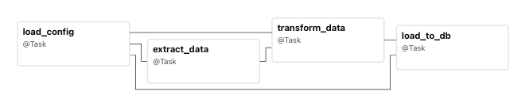
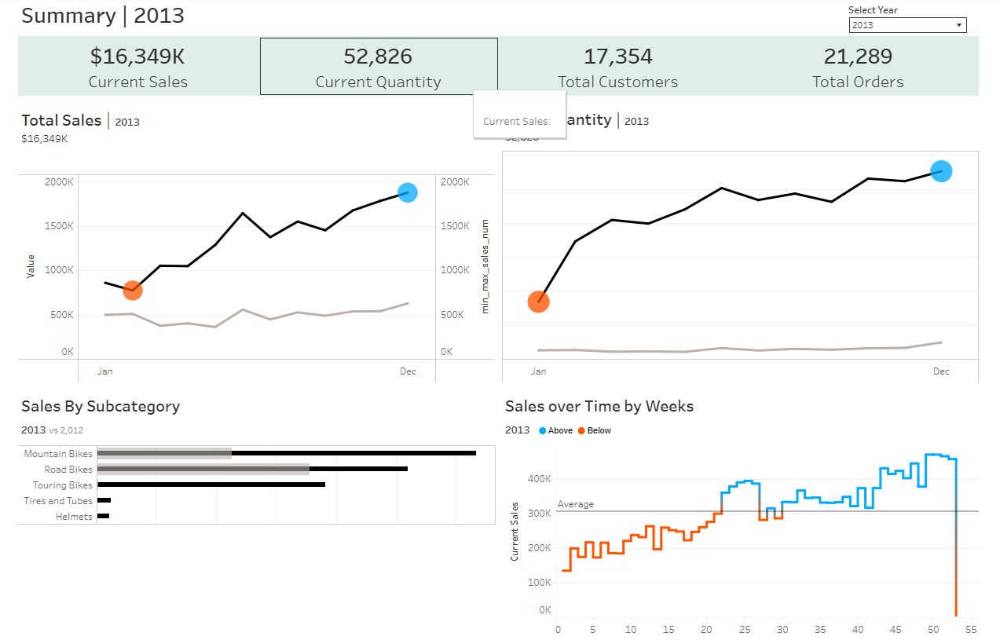

# ETL Demo: Data Warehousing & Analytics Pipeline with Airflow


This project showcases a complete data warehousing and analytics pipeline using Airflow. It covers the entire ETL workflow — from ingesting raw data, transforming it with Python, loading it into a PostgreSQL database, to ultimately visualizing the results with Tableau. 

## Objective

1. **Data Ingestion**: Import CSV data from ERP and CRM source systems. Sample datasets can be found at [link](https://github.com/DataWithBaraa/sql-data-warehouse-project/tree/main/datasets).

2. **Data Cleaning**: Execute data cleansing operations, including but not limited to, the resolution of null values and empty string inconsistencies.

3. **Data Loading**: Transfer the prepared data into a PostgreSQL database

4. **Data Analytics**: Explore data and prepare analyzed data for reporting

5. **Data Visualization**: Visualize the data using Tableau

## Repository Structure

```
project-root/
├── dags/ # Airflow DAG scripts
├── src/ # ETL scripts and pipeline code
│ ├── main.py # Main entry point for running ETL
│ ├── etl/ # Extraction, transformation, and loading modules
│ └── utils/ # Utility scripts (e.g., logging config)
│
├── data/ # Raw and processed CSV files
│
├── etl.log # Log file generated during ETL runs
|
├── requirement.txt #  Dependencies for running the pipeline
├── requirements.txt # # Packages required for Airflow
│
└── README.md # Project overview and instructions
```

# How to Run

Clone the repository:

```
git clone https://github.com/yourusername/etl-demo.git
```

Run the ETL pipeline alone:

```
python src/main.py
```
Check `etl.log` for detailed logs.

To run the Airflow DAGs:
```
astro dev start
```


## Logging

Info level and above are logged to `etl.log`.

Debug and above are output to the console for real-time monitoring.

## Data Analytics

SQL queries are stored in [doc](doc)

- [create_views.sql](doc/create_views.sql) : SQL queries for creating view
- [data_exploration.sql](doc/data_exploration.sql): SQL queries for data exloraton
- [reports_analytics.sql](doc/reports_analytic.sql): SQL queries for group data into categories for insights

## Visualization

The final dashboard showcasing the sales data can be viewed here: [link](https://public.tableau.com/views/Sales_dashboard_17513199682000/Dashboard1?:language=en-US&:sid=&:redirect=auth&:display_count=n&:origin=viz_share_link)


