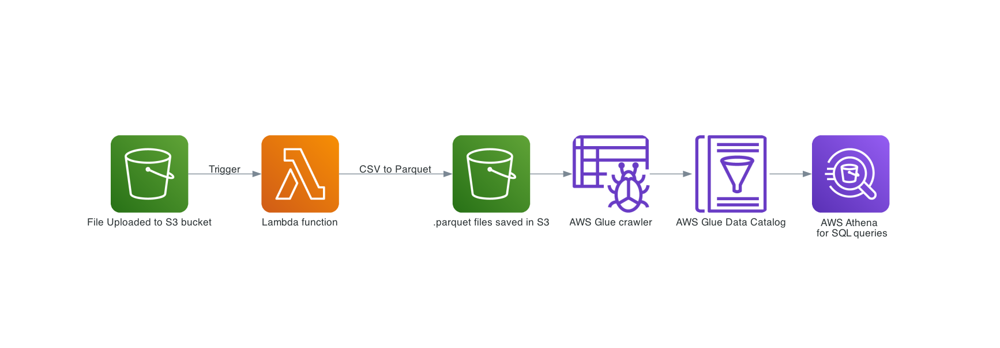
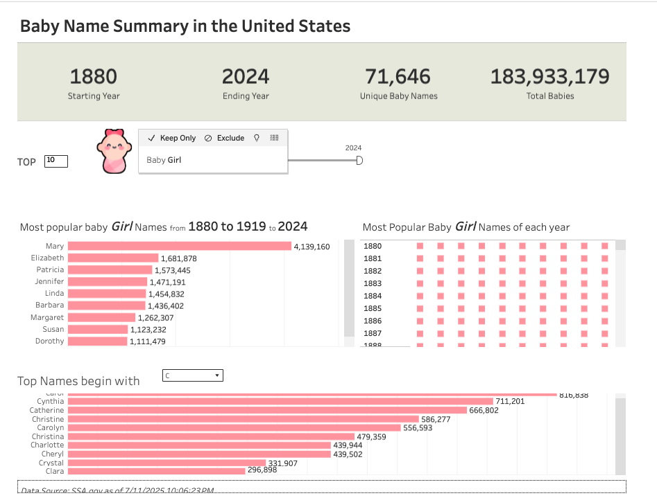

# US Baby Name Analysis


This project extracts U.S. baby name data from the Social Security Administration (SSA) dataset, uploads the extracted files to Amazon S3, and triggers a Lambda function to convert the data from CSV to Parquet format for more efficient processing. A Glue crawler is then triggered to update the table schema, enabling direct querying via Amazon Athena. The entire infrastructure is provisioned using Terraform, and the data pipeline is fully automated using Apache Airflow.


## Features
- Automated Data Pipeline with Apache Airflow: \
The entire ETL workflow—from data extraction and upload, to transformation, schema crawling, and query readiness—is orchestrated and automated using Apache Airflow.

- Extract Baby Names and occurences by year
Parses official U.S. baby name data from the SSA (Social Security Administration) datasets.

- Infrastructure as Code with Terraform \
Provisions the entire AWS infrastructure, including:

    - Create an IAM policy and role, attach the policy to the role, and assign the role to a Lambda function, and Glue crawler

    - Create an AWS Lambda function with a Lambda Layer that includes the Pandas SDK.

    - Add a trigger to the Lambda function: when a file is uploaded to an S3 bucket, the function transforms the file to Parquet format and save in another S3 bucket.
    - AWS Glue Crawler is triggered when a parquet file is saved in the designated S3 bucket. 


- Uses AWS Athena to perform SQL queries over the transformed Parquet files stored in S3.

- Baby Names Analysis:
    Once the baby name data is transformed to Parquet and available in S3, use AWS Athena to run SQL queries for trend analysis and insights. The `doc/name_analysis.sql` file contains predefined queries, including examples for:

    - Top names of all time
    - Top names of the year
    - Popular names by gender
    - Popular names with longest streak

## Project Structure
```
project-root/
│
├── dags/
│   ├── get_ssa_data.py 
|                     
├── terraform/ # AWS-related infrastructure and code
│   ├── main.tf              # Main Terraform configuration
│   ├── layer/
│   │   └── awswrangler-layer-3.12.1-py3.9.zip
│   └── lambda_function/
│       ├── function.zip
│       └── lambda_function.py
│
├── data/                        # Raw and processed CSV files
├── doc/                        # Raw and processed CSV files
|   ├── name_analysis.sql        # SQL queries for the analysis
│
└── README.md                    # Project documentation
```

## Installation & Deployment
### Run Airflow
```
astro dev init
astro dev start
```
### Deploy Infrastructure with Terraform

```
cd terraform
terraform init
terraform apply
```

Confirm the plan to provision:
- IAM role and policy
- S3 bucket
- Lambda function with layer
..

After running `terraform apply`, Terraform will provision the necessary resources and output the generated S3 bucket name and Lambda function name for the project. Be sure to update these values in the `config.ini` file before triggering the workflow with Airflow.

## Data Visualization

[View the interactive dashboard on Tableau](https://public.tableau.com/shared/PXC564KHY?:display_count=n&:origin=viz_share_link)

## To Do
- Add unit tests
