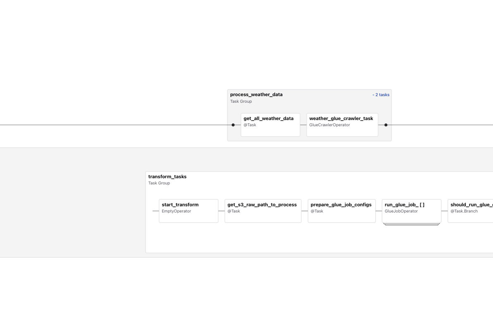

# NYC Citi Bike Data Engineering Project
This project is a modern data pipeline built to ingest, transform, store, and analyze NYC Citi Bike trip data, enriched with weather information. It leverages modern data engineering tools including Apache Airflow, Terraform, AWS Glue, Amazon S3, Redshift, Athena, dbt, and Tableau for end-to-end orchestration, data transformation, warehousing, and visualization.

## Stacks


## Workflow Summary


Use **Terraform** to set up infrastucture, includes: 
- Amazon S3 bucket
- IAM roles and policies
- Redshift cluster
- AWS Glue crawlers, and catalog

Use **Airflow** to orchestrate the workflow: 
1. Ingest historical weather data from open-meteo API
2. Ingest NYC Citi Bike trip data ([src here](https://s3.amazonaws.com/tripdata/index.html)) from year 2020. iThe ingestion can be performed as a full load or incrementally by downloading data from the previous month. 
3. Uploads extracted data to S3 raw zone
4. Perform data cleaning and transformation using **PySpark** scripts, orchestrated and executed through **AWS Glue**
5. Stores cleaned data as Parquet files in S3 clean zone
6. Crawls the cleaned data and populates the AWS Glue Data Catalog 
7. Use **dbt** to create `citibike_facts` table, join nyc citi bike trips with weather data


Use **Athena** or **Redshift spectrum** for data queries and visualize data using **Tableau**

## Installation & Deployment
### Prerequisites
- AWS credentials configured
- Apache Airflow environment is set up using Astro (`astro dev init`)
- Terraform is installed and initialized(`terraform init`)
- dbt project is initialized (`dbt init`)
- Tableau Public is installed and ready for use

### How to run (Step by step)
#### 1. Provision Infrastructure
AWS credentials is saved in terraform/secret.tfvars. 
```
terraform apply  -var-file="secret.tfvars"
```
AWS resources including an IAM role, S3 bucket, and Redshift cluster are provisioned. The names of these resources are also output for easy reference and can be copied into the `airflow_settings.yaml` file.

#### Start Airflow Scheduler

``` astro dev start```

Trigger the Pipeline DAG on airflow UI


## Project Structure
```
root_project/
│
├── dags/                      # Airflow DAGs
├── terraform/                 # Terraform IaC modules
|   ├── my_glue_job.py         # PySpark scripts for AWS Glue
├── dbt_athena/               # dbt staging and data martmodels 
├── analysis/               # data queries and visualizations 
└── README.md
```
## Data Visualization

[View the interactive dashboard on Tableau](https://public.tableau.com/views/citibiketwb_2025/Dashboard?:language=en-US&publish=yes&:sid=&:redirect=auth&:display_count=n&:origin=viz_share_link)