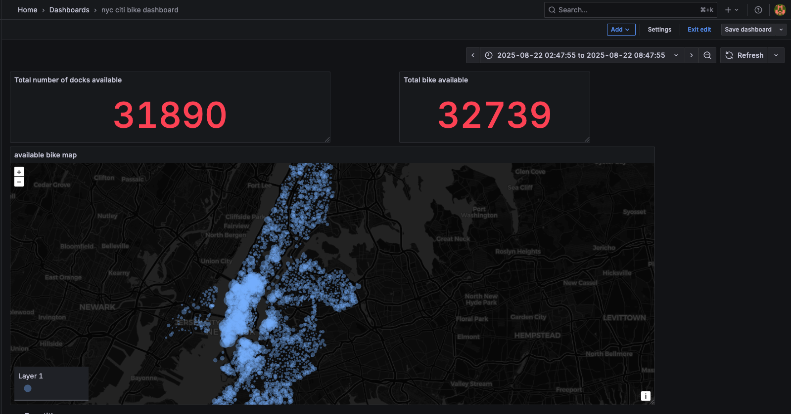

# NYC Citi Bike Streaming Pipeline
This project sets up a real-time data pipeline to ingest, process, and visualize NYC Citi Bike streaming data, displaying total docks, available bikes, and a live map of stations with bike availability.

## Stacks

- Redpanda: streaming data platform
- Apache Spark : stream processing
- PostgreSQL: streaming data storage
- Grafana: real-time dashboard visualization

## Workflow Summary
          ----------------------
            NYC Citi Bike Feed 
          ----------+-----------
                     |
                     v
          ----------------------
               Redpanda (Kafka)
          ----------+-----------
                     |
                     v
       ----------------------------
         Spark Structured Streaming
        (reads from Redpanda topic)
       ------------+---------------
                     |
                     v
          ----------------------
              PostgreSQL tables     
          ----------+----------
                     |
                     v
          ----------------------
                Grafana       
              (dashboard)
          ----------------------

## Installation & Deployment
0. Go to the project directory

1. Start all services using docker compose:

`docker compose up --build --remove-orphans  -d `

This will spin up:
- Redpanda 
- Python environment
- Spark master and worker nodes
- PostgreSQL server
- pgAdmin
- Grafana

2. Send streaming data to Redpanda:

Run the following commands to produce station data into Redpanda:
```
docker exec -it python-client python src/producers/load_station_info.py

docker exec -it python-client python src/producers/load_station_status.py
```

3. Start Spark streaming jobs to consume and load data into PostgreSQL

Run an interactive Spark container
```
docker run --rm -it  -e SPARK_MASTER="spark://spark-master:7077"  -v $PWD/src/spark:/app --network 03_nyc_citi_bike_streaming_default -p 4040:4040 docker.io/bitnami/spark /bin/bash
```

Once inside the container, run the following Spark jobs:

```

    spark-submit \
    --packages org.apache.spark:spark-sql-kafka-0-10_2.13:4.0.0 \
    --master spark://spark-master:7077 \
    --jars /app/postgresql-42.7.6.jar \
    /app/station_info_spark.py station_info


    spark-submit \
--packages org.apache.spark:spark-sql-kafka-0-10_2.13:4.0.0 \
--master spark://spark-master:7077 \
--jars /app/postgresql-42.7.6.jar \
/app/station_status_spark.py station_status
```
4. Visualize live data in Grafana.

Go to http://localhost:3000/

Log in with default credentials: admin / admin

In the Connections tab, choose postgres as connection. 

Then go to Dashboards, create new Dashboard and use following SQL queries for visualizations:

```
WITH cte AS (
SELECT station_id, num_bikes_available,num_docks_available,
ROW_NUMBER()OVER(PARTITION BY station_id ORDER BY event_time DESC ) AS rnk
FROM station_status
)

-- total dock available
SELECT SUM(num_docks_available)
FROM cte
JOIN station_info 
	ON station_info.station_id = cte.station_id 
WHERE cte.rnk =1

-- total bik available
SELECT station_info.name, station_info.longitude, station_info.latitude, cte.num_bikes_available
FROM cte
JOIN station_info 
	ON station_info.station_id = cte.station_id 
WHERE cte.rnk =1

-- 

```

