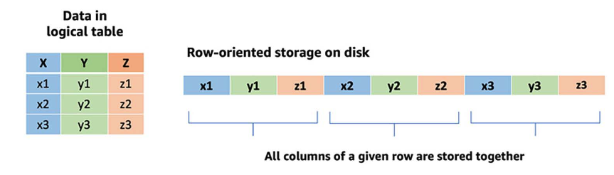
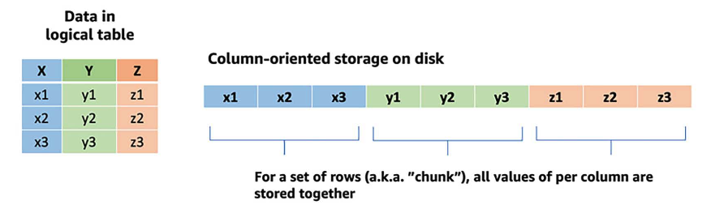
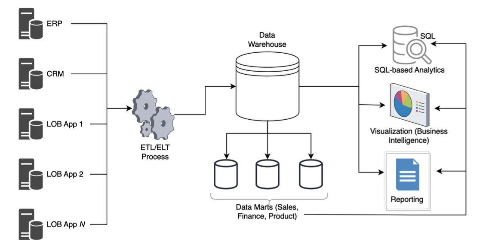
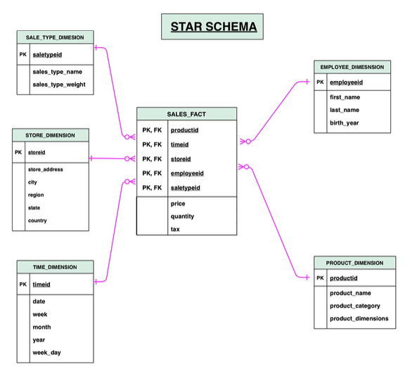
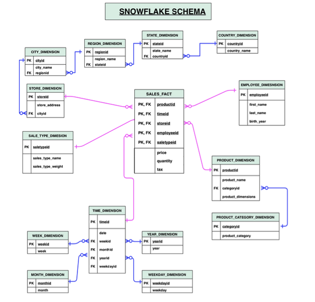
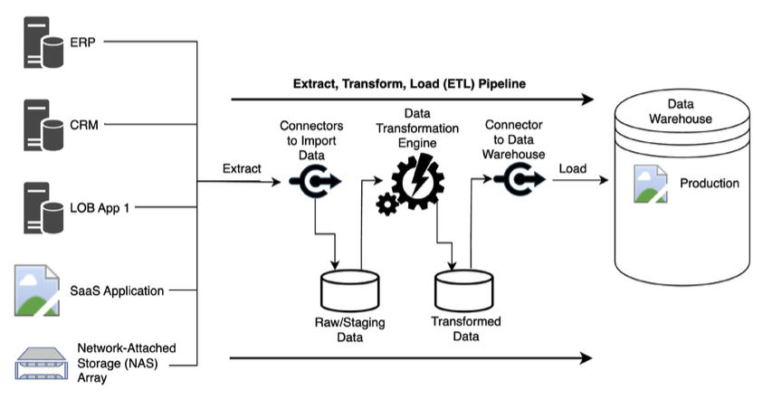
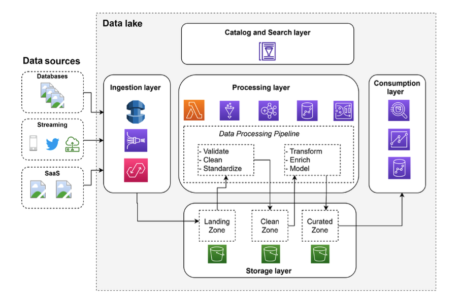

- Lambda Layer is a distribution mechanism for libraries, custom runtimes, and other function dependencies. It allows you to manage and share code more easily across multiple AWS Lambda functions without having to include it in every function's deployment package
- AWS SDK for pandas — previously called AWS Data Wrangler — is an open-source Python library that bridges the gap between pandas and AWS data services. It allows you to seamlessly use pandas with services like Amazon S3, Redshift, Athena, Glue, Timestream, and more.If you don’t use the AWS SDK for pandas (awswrangler) and want to interact with AWS data services using Python, the original method is typically using the AWS SDK for Python — boto3
- ACID transactions: refer to 4 keys properties of a transation: atomicity (transaction is treated as a single, indivisible unit), consistency, isolation and durability 
- OLTP (Online Transation Processing): store and update *transactional* data. typically work with entire rows that include all the columns of the table. To speed up full-row lookups and updates, OLTP databases use a row-oriented layout to store table rows on the disk

- OLAp (Onlien Analytical Processing): used for reporting large volumnes of data

- data warehouse: store integrated, hihgly curated, trusted data that was structured. Data would be ingested on a
regular basis from other highly structured sources, but before entering the data warehouse, the
data would go through a significant amount of pre-processing, validation, and transformations
- Normalization: organizes data in a relational database to minimize data redundancy and improve data integrity.
- EDW(enterprise Data warehouse): central data repository that contains structured,
curated, consistent, and trusted data assets that are organized into a well-modeled schema

    - fact table:Facts are where all the things can exist many times, often denormalized (e.g sales table), stores measures; central table in the data schemas.consists of two types of columns. The foreign keys column allows to join with dimension tables and the measure columns contain the data that is being analyzed.
    - dimension table: where they only exist once and are described, stores descriptive information (attributes) about the data in a fact table
    - star schema : data for a subject area is normalized by splitting measurements and
context information into separate fact and dimension tables, individual dimension tables are
typically kept denormalized so that all related attributes of a dimensional topic can be found in
a single table.
    
    - snowflake schema: The challenges of inconsistencies and duplication in a star schema can be addressed by snow-
flaking (basically normalizing) each dimension table into multiple related dimension tables
(normalizing the original product dimension into product and product category dimensions, for
example). This normalization of tables continues until each individual dimension table contains
only attributes with a direct correlation with the table’s primary key.
    
- data marts: A data mart is a subset of a data warehouse, focused on a specific subject area or business unit, providing faster access to more focused data
- modern datawarehouse use column-oritented storage and data compression
- Feeding data into wareehouse: ELT OR ETL 

- data lake: bringing together a variety of data of all sizes and types (structured, semi-structured, or unstructured) in one place

    - Structured data (row-column based tables)
    - Semi-structured data (such as JSON and XML files, log records, and sensor data streams)
    - Unstructured data (such as audio, video streams, Word/PDF documents, and emails)
- data lake consists of: 
    - Storage layer
    - catalog and search layers
        - technical catalog
        - business catalog
    - ingestion layer: A typical ingestion layer may include tools such as AWS Database Migration Service (DMS) for
ingesting from various databases, Amazon Kinesis Firehose for ingesting streaming data, and
Amazon AppFlow for ingesting data from SaaS applications.
    - processing layer: tools commonly used in this layer include AWS Glue and Amazon EMR. transform
data with frameworks such as Apache Spark, to train machine learning models on the data using
tools such as Amazon SageMaker
    - consumption layer
- limitations of data lake: raditional implementations of data lakes do not support the ACID. worked around by loading a subset of the data from the data lake into a data warehouse, such as Amazon Redshift or Snowflake

- data lake house: data warehouse + data lake. Table formats in dta lake house:
    - Delta Lake
    - Apache Hudi
    - Apache Iceberg

# AWS services for ingesting data
- Amazon DMS: Amazon DMS simplifies migrating from one database engine to a different database
engine or syncing data from an existing database to Amazon S3 on an ongoing basis. USe CDC: Change Data Capture
- Amazon Kineses: process of ingesting and processing streaming data in real time, or near real time
    - Kinesis Data Firehose: ingest streaming data, write out to targets (S3, Redshift, OpenSearch Service, Splunk)
    - Kinesis Data Streams: ingest real time data streams
    - Kinesis Data analysis: read data from streaming source and use SQL statements or Apache flink code to perform analytics on the stream
    - Kinesis Video Streams: process streaming video or audio streams
- Amazon MSK: managed version of Apache kafka on AWS
- Amazon appFlow: ingesting data from SaaS serves
- aws transfer family: 
- aws Data sync: ingesting from on premises and multicloud storage services
- aws snow family
- aws glue: serveless Apache Spark environment for data ingestion and transformation

# AWS services for transforming data
- AWS Lambda for light transformations: can run up to 15 min, mazimum memory of 10GB
- AWS Glue: serverless, user need to specify Data Processing Units (DPUS)
- AWS Glue DataBrew: apply transformations to data wo write or manage any code
- AWS Glue Data catalog: provide logical view of data in the storage layer
 - AWS EMR: open source big data processing tools such as Apache Spark, Hive, Hudi,Presto, Pig...

-MWAA (Managed Workflows for Apache Airflow): enable users to deploy Airflow that can automatically scale out
not a serverless environement like Amazon Step Functions

# AWS services for consuming  data
- Amazon Athena 
- Athena Federated Query: build connectors so that Athena can query other data sources beyond S3 like Amazon DynamoDB(NoSQL), Cloudwatch logs
- you can even run Apache Sparkjobs with Athena
- Amazon Redshift: for reporting and analytic workloads
- Amazon Redshift Spectrum: enable user to write query that gather data loaded into data warehouse and data exists outside data warehouse (in data lake)
-Amazon Quicksight for visualizing the data