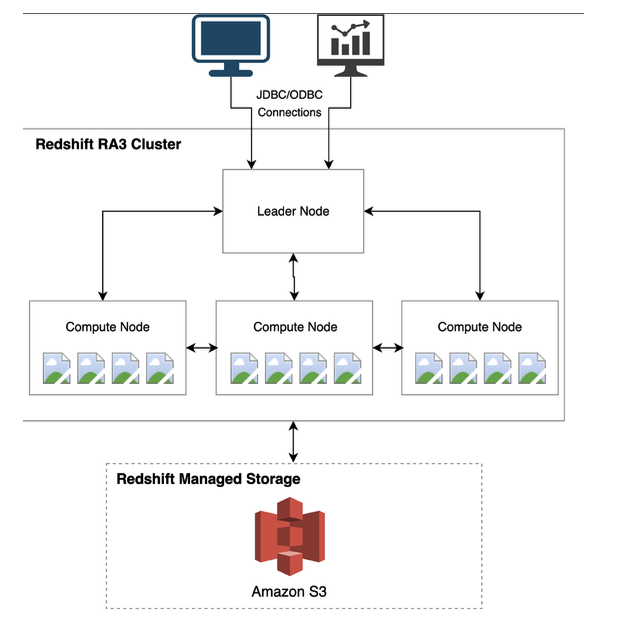

  Data may be cleansed and processed with Glue ETL jobs in the
data lake, for example, and then hot data can be loaded into Redshift so that it can be queried via
BI tools with optimal performance.
 There are various different types of Redshift nodes, and this figure below shows a Redshift cluster based on RA3 nodes

-  leader node interfaces with client applications, receives and parses queries, and coordinates query execution on compute nodes
- compute nodes have high-performance storage for storing a subset of the warehouse data and run query execution steps in parallel on the data that they store. Each compute node has its own independent processors, memory, and high-performance storage volumes that are isolated from other compute nodes in the cluster
- RA3 node types (as illustrated in this diagram), Amazon S3 is used as Redshift Managed Storage (RMS) for warehouse data, and the compute node high-performance local storage is used as a cache for hot data
-MPP (massively Parallel Processing): the cluster leader node first compiles the incoming client query into a distributed execution plan. It then coordinates the execution of segments of compiled query code on multiple compute nodes of the data warehouse cluster, in parallel. Each compute node executes assigned query segments on a portion of the distributed dataset.